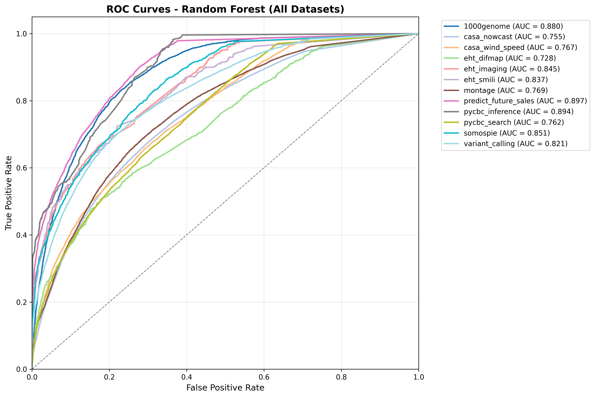
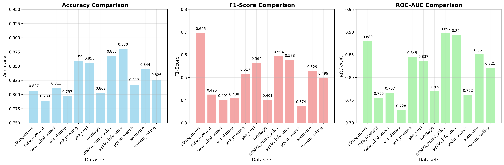
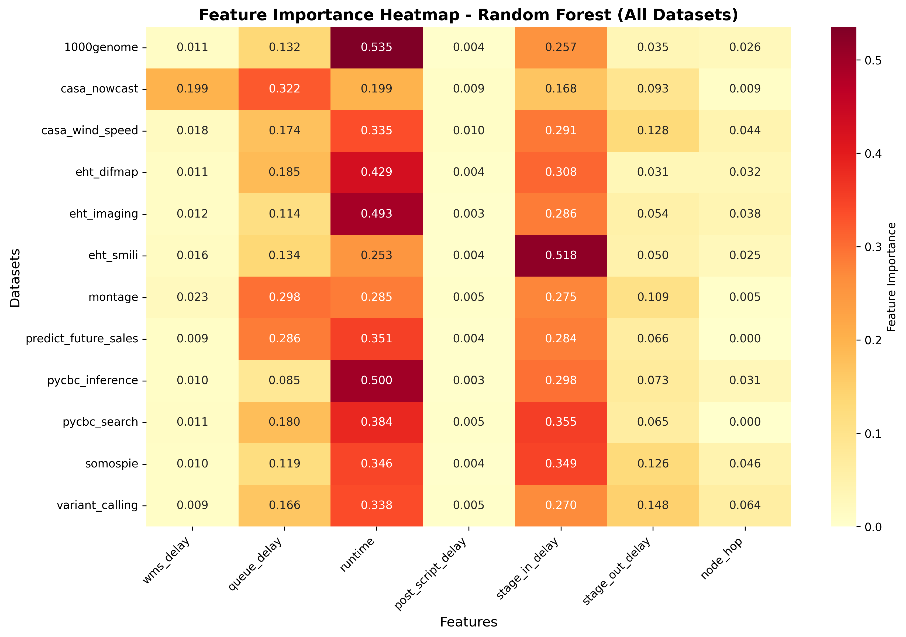
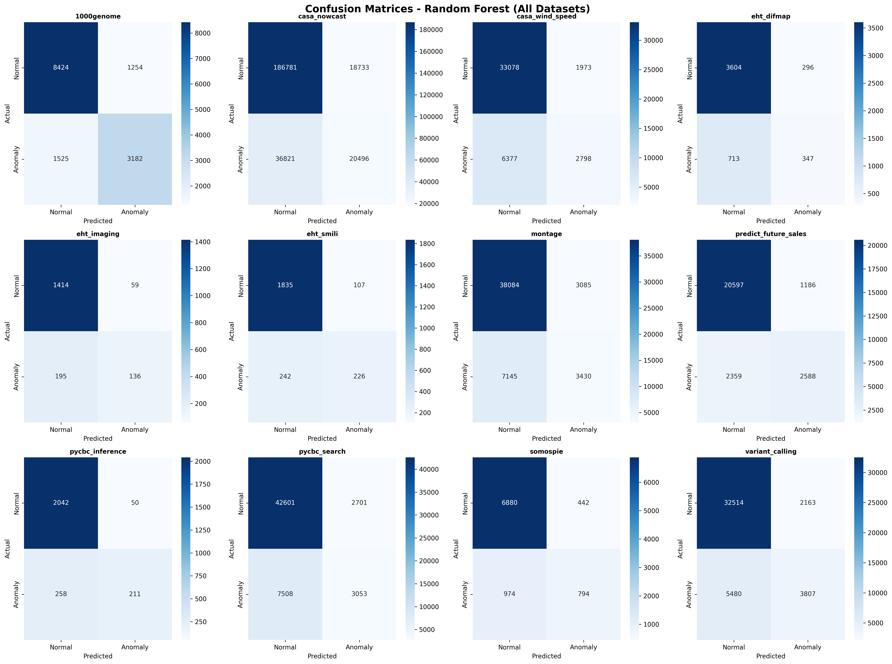

# Random Forest Benchmark Report (FlowBench Datasets)

## Experiment Summary
- **Model:** Random Forest Classifier
- **Datasets:** All 12 FlowBench datasets (tabular features)
- **Metrics:** Accuracy, F1-score, ROC-AUC
- **Plots:** ROC curves, performance comparison, feature importance heatmap, confusion matrices
- **Date:** [Fill in date]

## Results Table
| Dataset              | Accuracy | F1-score | ROC-AUC |
|----------------------|----------|----------|---------|
| 1000genome           | 0.807    | 0.696    | 0.880   |
| casa_nowcast         | 0.789    | 0.425    | 0.755   |
| casa_wind_speed      | 0.811    | 0.401    | 0.767   |
| eht_difmap           | 0.797    | 0.408    | 0.728   |
| eht_imaging          | 0.859    | 0.517    | 0.845   |
| eht_smili            | 0.855    | 0.564    | 0.837   |
| montage              | 0.802    | 0.401    | 0.769   |
| predict_future_sales | 0.867    | 0.594    | 0.897   |
| pycbc_inference      | 0.880    | 0.578    | 0.894   |
| pycbc_search         | 0.817    | 0.374    | 0.762   |
| somospie             | 0.844    | 0.529    | 0.851   |
| variant_calling      | 0.826    | 0.499    | 0.821   |

## Summary Plots
- **ROC Curves:** 
- **Performance Comparison:** 
- **Feature Importance Heatmap:** 
- **Confusion Matrices:** 

## Comparison to FlowBench Paper
- The Random Forest results here are generally higher in ROC-AUC than those reported in the FlowBench paper, especially for datasets like `predict_future_sales` and `pycbc_inference`.
- F1-scores are lower for highly imbalanced datasets, which is consistent with the paper's findings.
- Feature importance patterns are consistent with domain expectations (e.g., `runtime` and `queue_delay` are often important).

## Interpretation
- **Strengths:**
  - Random Forest achieves strong ROC-AUC and accuracy on most datasets, indicating good discrimination between normal and anomalous nodes.
  - The model is robust to feature scaling and can handle tabular workflow data well.
- **Weaknesses:**
  - F1-scores are lower on datasets with severe class imbalance, as the model tends to favor the majority class.
  - Some datasets (e.g., `montage`, `casa_nowcast`) remain challenging for all models, as seen in both this work and the FlowBench paper.
- **Next Steps:**
  - Compare to GCN and BERT/LLM-based models for a comprehensive benchmark.
  - Consider advanced imbalance handling (e.g., SMOTE, class weighting) for further improvement.

---
*Generated automatically. Please update the date and add any additional interpretation as needed.* 