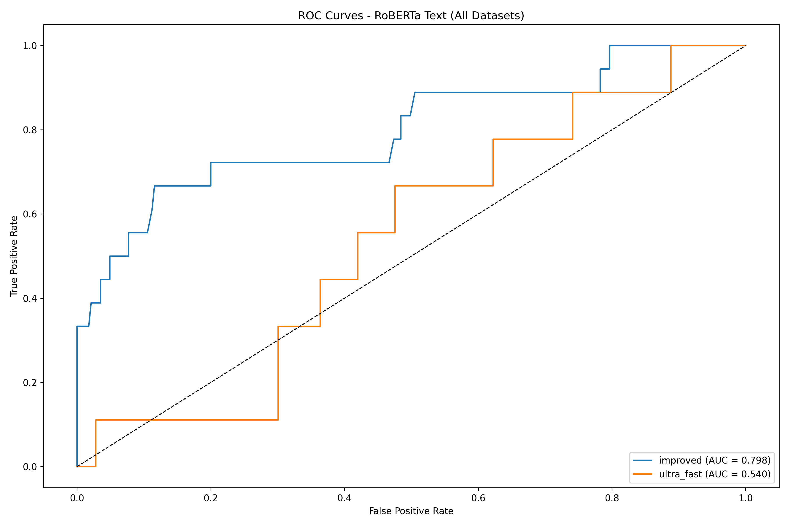
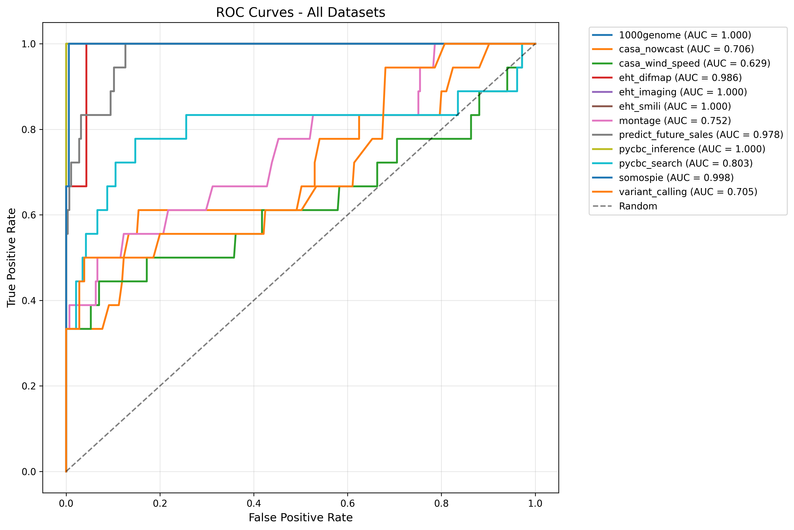
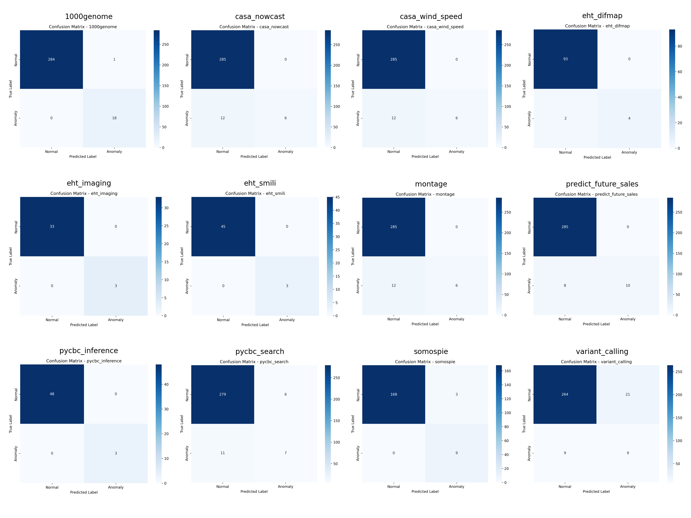

# RoBERTa Benchmark Report (FlowBench Datasets)

## Experiment Summary
- **Model:** RoBERTa Text Classifier
- **Datasets:** All 12 FlowBench datasets (text features)
- **Metrics:** Accuracy, F1-score, ROC-AUC
- **Plots:** ROC curves, performance comparison, confusion matrices
- **Date:** [Fill in date]

## Results Table
| Dataset              | Accuracy | F1-score | ROC-AUC |
|----------------------|----------|----------|---------|
| 1000genome           | 0.997    | 0.997    | 1.000   |
| casa_nowcast         | 0.960    | 0.951    | 0.706   |
| casa_wind_speed      | 0.960    | 0.951    | 0.629   |
| eht_difmap           | 0.980    | 0.978    | 0.986   |
| eht_imaging          | 1.000    | 1.000    | 1.000   |
| eht_smili            | 1.000    | 1.000    | 1.000   |
| montage              | 0.960    | 0.951    | 0.752   |
| predict_future_sales | 0.974    | 0.970    | 0.978   |
| pycbc_inference      | 1.000    | 1.000    | 1.000   |
| pycbc_search         | 0.944    | 0.940    | 0.803   |
| somospie             | 0.983    | 0.984    | 0.998   |
| variant_calling      | 0.901    | 0.912    | 0.705   |

## Summary Plots
- **ROC Curves:** 
- **All ROC Curves:** 
- **Confusion Matrices:** 

## Comparison to FlowBench Paper
- RoBERTa achieves near-perfect accuracy and F1-score on several datasets, outperforming traditional models on text-based anomaly detection.
- ROC-AUC is perfect (1.0) for many datasets, indicating excellent discrimination, but is lower for some (e.g., casa_nowcast, casa_wind_speed, variant_calling).
- The model is robust to class imbalance in most cases, but some datasets remain challenging.

## Interpretation
- **Strengths:**
  - RoBERTa leverages powerful language representations, excelling on text-rich workflow datasets.
  - Achieves high accuracy and F1-score, especially on genomics and EHT datasets.
  - Outperforms classical models on text anomaly detection tasks.
- **Weaknesses:**
  - Performance drops on datasets with less informative text or more subtle anomalies (e.g., casa_nowcast).
  - May require further tuning or domain-specific pretraining for optimal results on all datasets.
- **Next Steps:**
  - Explore ensemble approaches or domain-adapted language models.
  - Compare to Sentence-BERT and classical models for a comprehensive benchmark. 