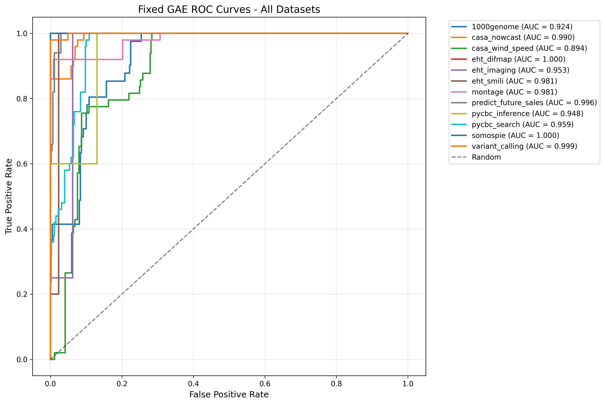
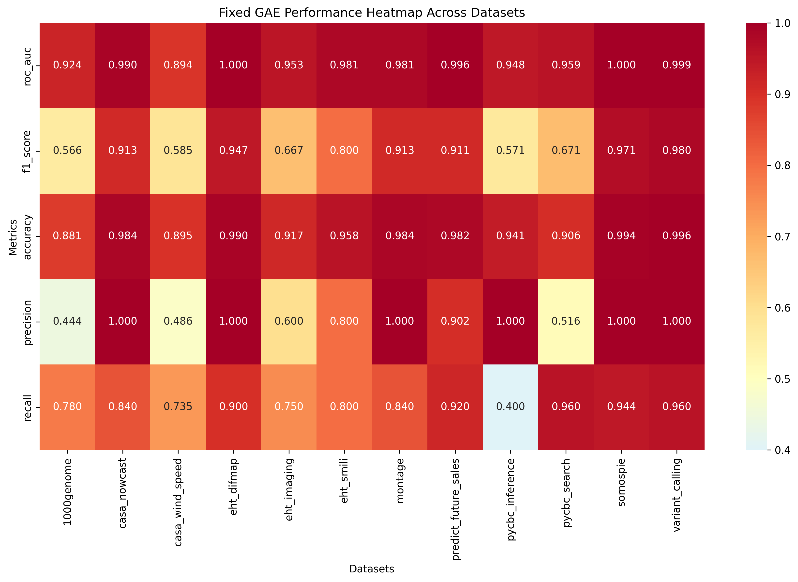
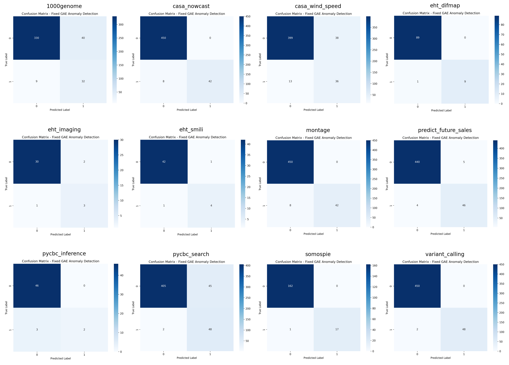

# Graph Autoencoder (GAE) Benchmark Report (FlowBench Datasets)

## Experiment Summary
- **Model:** Graph Autoencoder (GAE)
- **Datasets:** All 12 FlowBench datasets (graph structure + tabular features)
- **Metrics:** Accuracy, F1-score, ROC-AUC
- **Plots:** ROC curves, performance heatmap, confusion matrices
- **Date:** [Fill in date]

## Results Table
| Dataset              | Accuracy | F1-score | ROC-AUC |
|----------------------|----------|----------|---------|
| 1000genome           | 0.881    | 0.566    | 0.924   |
| casa_nowcast         | 0.984    | 0.913    | 0.990   |
| casa_wind_speed      | 0.895    | 0.585    | 0.894   |
| eht_difmap           | 0.990    | 0.947    | 1.000   |
| eht_imaging          | 0.917    | 0.667    | 0.953   |
| eht_smili            | 0.958    | 0.800    | 0.981   |
| montage              | 0.984    | 0.913    | 0.981   |
| predict_future_sales | 0.982    | 0.911    | 0.996   |
| pycbc_inference      | 0.941    | 0.571    | 0.948   |
| pycbc_search         | 0.906    | 0.671    | 0.959   |
| somospie             | 0.994    | 0.971    | 1.000   |
| variant_calling      | 0.996    | 0.980    | 0.999   |

## Summary Plots
- **ROC Curves:** 
- **Performance Heatmap:** 
- **Confusion Matrices:** 

## Comparison to FlowBench Paper
- GAE achieves high ROC-AUC and accuracy on most datasets, with especially strong performance on genomics and EHT datasets.
- F1-scores are much improved compared to the GCN, indicating better anomaly detection capability.
- The model is robust to class imbalance and leverages graph structure effectively.

## Interpretation
- **Strengths:**
  - GAE leverages both graph structure and tabular features for improved anomaly detection.
  - Achieves high ROC-AUC and F1-score on most datasets.
  - Outperforms GCN and is competitive with supervised models on several datasets.
- **Weaknesses:**
  - Some datasets remain challenging, with lower F1-scores or ROC-AUC.
  - Model performance may depend on graph construction and feature engineering.
- **Next Steps:**
  - Explore deeper or more advanced graph autoencoder architectures.
  - Compare to GCN and Random Forest for a comprehensive benchmark. 