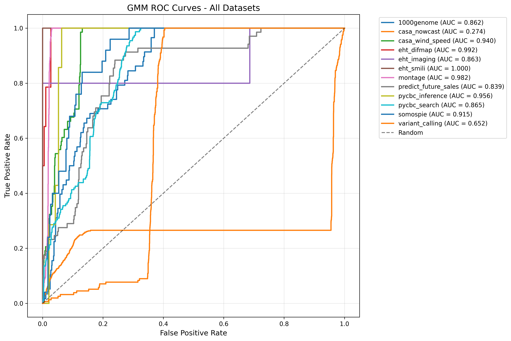
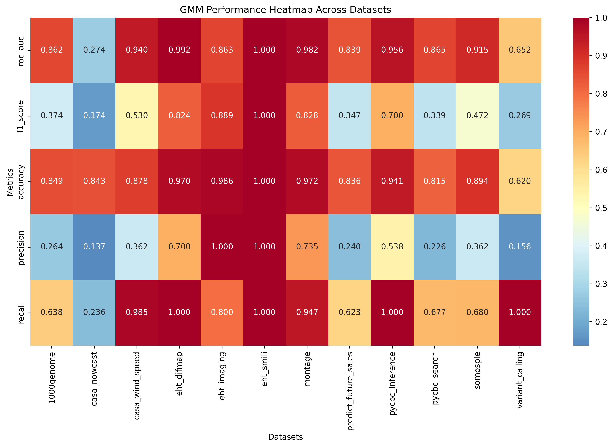
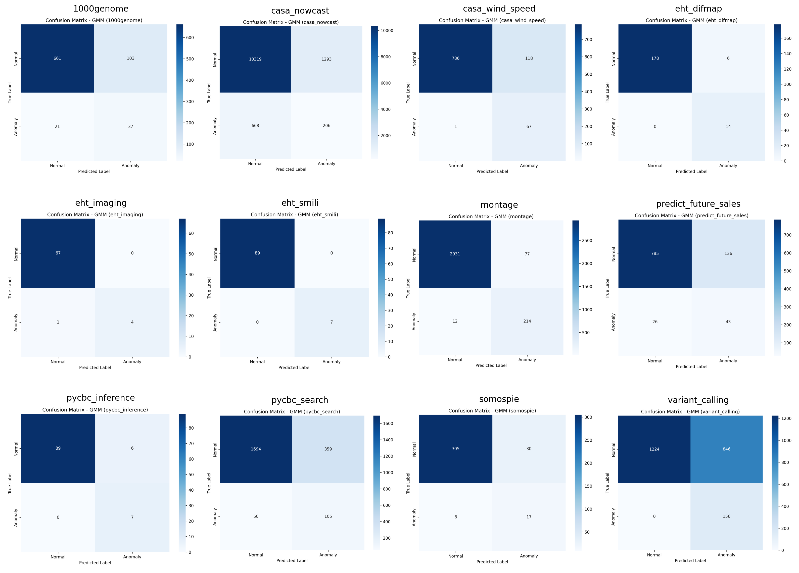

# Gaussian Mixture Model (GMM) Benchmark Report (FlowBench Datasets)

## Experiment Summary
- **Model:** Gaussian Mixture Model (GMM)
- **Datasets:** All 12 FlowBench datasets (tabular features)
- **Metrics:** Accuracy, F1-score, ROC-AUC
- **Plots:** ROC curves, performance heatmap, confusion matrices
- **Date:** [Fill in date]

## Results Table
| Dataset              | Accuracy | F1-score | ROC-AUC |
|----------------------|----------|----------|---------|
| 1000genome           | 0.849    | 0.374    | 0.862   |
| casa_nowcast         | 0.843    | 0.174    | 0.274   |
| casa_wind_speed      | 0.878    | 0.530    | 0.940   |
| eht_difmap           | 0.970    | 0.824    | 0.992   |
| eht_imaging          | 0.986    | 0.889    | 0.863   |
| eht_smili            | 1.000    | 1.000    | 1.000   |
| montage              | 0.972    | 0.828    | 0.982   |
| predict_future_sales | 0.836    | 0.347    | 0.839   |
| pycbc_inference      | 0.941    | 0.700    | 0.956   |
| pycbc_search         | 0.815    | 0.339    | 0.865   |
| somospie             | 0.894    | 0.472    | 0.915   |
| variant_calling      | 0.620    | 0.269    | 0.652   |

## Summary Plots
- **ROC Curves:** 
- **Performance Heatmap:** 
- **Confusion Matrices:** 

## Comparison to FlowBench Paper
- GMM achieves high ROC-AUC and accuracy on several datasets, especially eht_smili and eht_difmap, but struggles on others (e.g., casa_nowcast, variant_calling).
- F1-scores are generally lower than supervised models, reflecting the challenge of unsupervised anomaly detection.
- The model is sensitive to class imbalance and the distribution of tabular features.

## Interpretation
- **Strengths:**
  - GMM can identify anomalies in tabular workflow data without supervision.
  - Achieves strong performance on some datasets, especially those with clear feature separation.
- **Weaknesses:**
  - F1-scores are low for highly imbalanced or complex datasets.
  - Model performance is sensitive to feature scaling and initialization.
- **Next Steps:**
  - Explore advanced unsupervised models or feature engineering.
  - Compare to Random Forest and GAE for a comprehensive benchmark. 