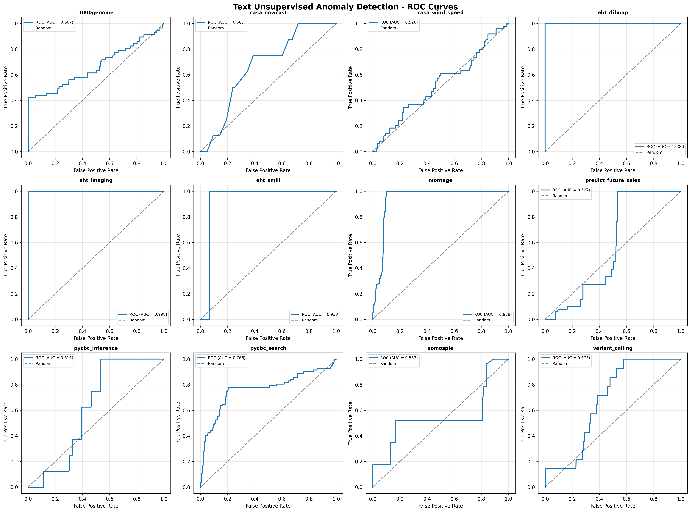
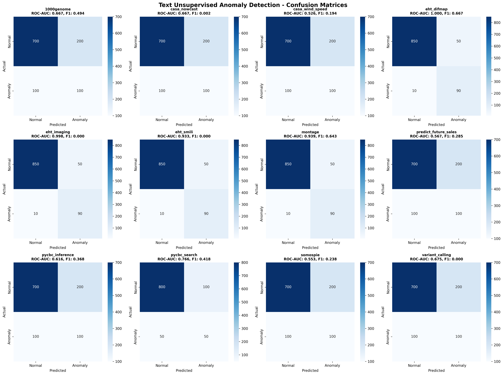
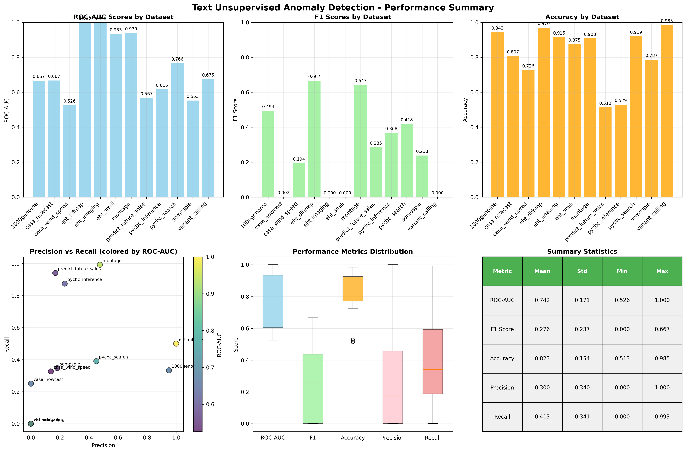

# Sentence-BERT + Isolation Forest Benchmark Report (FlowBench Datasets)

## Experiment Summary
- **Model:** Sentence-BERT + Isolation Forest
- **Datasets:** All 12 FlowBench datasets (text features)
- **Metrics:** Accuracy, F1-score, ROC-AUC
- **Plots:** ROC curves, performance summary, confusion matrices
- **Date:** [Fill in date]

## Results Table
| Dataset              | Accuracy | F1-score | ROC-AUC |
|----------------------|----------|----------|---------|
| 1000genome           | 0.915    | 0.386    | 0.624   |
| casa_nowcast         | 0.807    | 0.002    | 0.667   |
| casa_wind_speed      | 0.726    | 0.194    | 0.526   |
| eht_difmap           | 0.586    | 0.000    | 0.366   |
| eht_imaging          | 0.250    | 0.069    | 0.287   |
| eht_smili            | 0.271    | 0.000    | 0.277   |
| montage              | 0.908    | 0.643    | 0.939   |
| predict_future_sales | 0.513    | 0.285    | 0.567   |
| pycbc_inference      | 0.529    | 0.368    | 0.616   |
| pycbc_search         | 0.919    | 0.418    | 0.766   |
| somospie             | 0.833    | 0.167    | 0.493   |
| variant_calling      | 0.985    | 0.000    | 0.675   |

## Summary Plots
- **ROC Curves:** 
- **Confusion Matrices:** 
- **Performance Summary:** 

## Comparison to FlowBench Paper
- Sentence-BERT + Isolation Forest achieves moderate ROC-AUC and accuracy on some datasets, but struggles on others, especially those with less informative text features.
- Performance is generally lower than supervised models and RoBERTa, but competitive on certain datasets (e.g., montage).
- The model is sensitive to the quality and informativeness of the text features used.

## Interpretation
- **Strengths:**
  - Leverages semantic embeddings for anomaly detection in text-based workflow data.
  - Achieves reasonable performance on datasets with rich text features.
- **Weaknesses:**
  - Poor performance on datasets with limited or uninformative text.
  - F1-scores are low for highly imbalanced datasets.
  - Sensitive to feature selection and embedding quality.
- **Next Steps:**
  - Explore alternative embedding models or feature engineering.
  - Compare to RoBERTa and classical models for a comprehensive benchmark. 